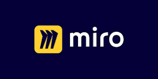

# Blocktopus
## Design and implementation of a website to show the market shares of individual cryptocurrencies
Under the working title Blocktopus, a web application was designed and implemented that allows the user to get a quick overview of the market shares of individual cryptocurrencies in the overall market and to allocate a desired investment within this asset class according to market capitalization.

Many techniques from agile project management and modern software development were used in the planning and programming. A particular focus was on the holistic implementation of a software development process that encompasses all elements from the capture of initial ideas in a project charter to the creation of prototypes and the use of a complete CI/CD pipeline.

Even though there is still some room for improvement in management process and programming, the use of various adequate methods and tools made it possible to develop a helpful application that facilitates orientation in the often confusing crypto market.

--- 

A variety of technologies were used to build the application and learn modern tools.

  &nbsp; &nbsp;  &nbsp;&nbsp;&nbsp;
  &nbsp; &nbsp;  &nbsp; &nbsp;  &nbsp; &nbsp;  &nbsp; &nbsp;  

