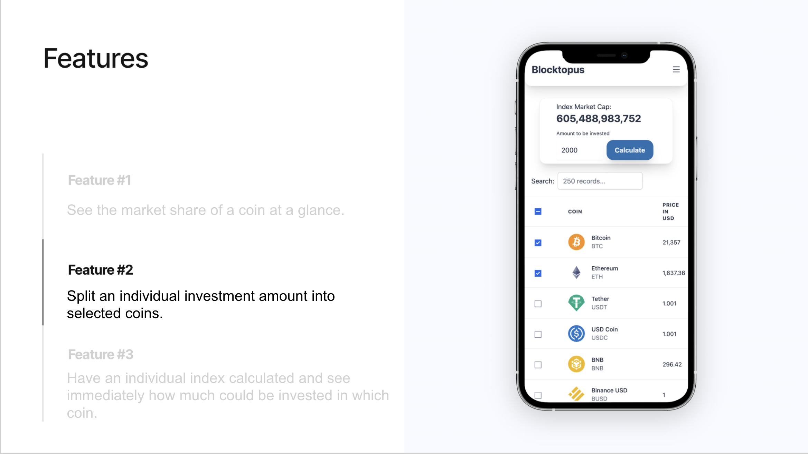

# Blocktopus
## Design and implementation of a website to show the market shares of individual cryptocurrencies

Under the working title Blocktopus, a web application was designed and implemented that allows the user to get a quick overview of the market shares of individual cryptocurrencies. Furthermore, it can be calculated how a portfolio would have to be composed if all coins were weighted according to their market shares. 

Many techniques from agile project management and modern software development were used in the planning and programming. A particular focus was on the holistic implementation of a software development process that encompasses all elements from the capture of initial ideas in a project charter to the creation of prototypes and the use of a complete CI/CD pipeline.

Even though there is still some room for improvement in the management process and programming, the use of various adequate methods and tools made it possible to develop a helpful application that facilitates orientation in the often confusing crypto market.

--- 

## Some of the used Tools and Technologies

 
 &nbsp; &nbsp; 
 &nbsp;&nbsp;
 
 &nbsp; &nbsp; 
 &nbsp; &nbsp; 
 &nbsp; &nbsp; 
 &nbsp; &nbsp; 
 &nbsp; &nbsp; 
 &nbsp; &nbsp; 
 

--- 
## The Backlog (written in german)

  

Here is a link to the [Backlog](https://sharing.clickup.com/2508839/l/h/2cj17-17481/bc52fd712ec9819). 

--- 
## Wireframe and Prototype

The [prototype](https://www.figma.com/proto/YGsZPC8MOaBuqyDl4GjkIW/Blocktopus?node-id=23%3A552&starting-point-node-id=23%3A552), which was designed before the actual programming, already contained some of the functions that can be found in the finished product.

--- 

## The Pitch Deck
Below are some impressions from the pitch deck:

 &nbsp;&nbsp;
 &nbsp;&nbsp;
 &nbsp;&nbsp;
 &nbsp;&nbsp;
 &nbsp;&nbsp;
 &nbsp;&nbsp;

